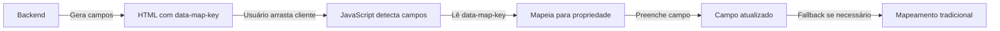

# 🚀 Sistema de Mapeamento Dinâmico Implementado

## 📋 Resumo da Solução

Implementamos uma solução moderna e flexível para o mapeamento automático de campos entre o formulário dinâmico e os dados do cliente, eliminando a necessidade de manter objetos de mapeamento estáticos no JavaScript.

## 🎯 Problema Resolvido

**Antes:**

- Mapeamento estático e rígido no JavaScript
- Difícil manutenção quando campos mudavam
- Campos não eram encontrados (logs mostravam "encontrado: NÃO")
- Total de campos preenchidos sempre 0

**Depois:**

- Mapeamento dinâmico via `data-*` attributes
- Backend define o mapeamento automaticamente
- JavaScript inteligente que se adapta aos campos disponíveis
- Fallback para compatibilidade com campos antigos

## 🏗️ Arquitetura da Solução

### 1. Backend: Geração Inteligente de Atributos

**Arquivo:** `app/peticionador/routes.py`

**Função:** `determine_client_map_key(field_key)`

```python
def determine_client_map_key(field_key):
    """
    Determina a chave do objeto cliente correspondente a um campo do formulário.

    Exemplos:
    - 'autor_1_nome' → 'primeiro_nome'
    - 'autor_2_cpf' → 'cpf'
    - 'autor_1_endereço_cidade' → 'endereco_cidade'
    """
    # Regex patterns para detectar:
    # - autor_1_nome, autor_2_cpf (numerados)
    # - autor_nome, autor_cpf (simples)
    # - campos diretos
```

**Implementação na geração do formulário:**

```python
# Em build_dynamic_form()
map_key = determine_client_map_key(ph.chave)
if map_key:
    field.render_kw["data-map-key"] = map_key
    current_app.logger.info(f"🔗 Campo '{ph.chave}' mapeado para cliente.{map_key}")
```

### 2. Frontend: JavaScript Inteligente

**Arquivo:** `templates/peticionador/formulario_dinamico_v2.html`

**Método:** `loadClienteData(cliente)`

```javascript
// 1. Busca campos com mapeamento dinâmico
const camposMapeaveis = document.querySelectorAll(
  '#peticao_form [data-map-key]'
);

// 2. Preenche automaticamente
camposMapeaveis.forEach(field => {
  const dataKey = field.dataset.mapKey;
  const valor = cliente[dataKey];

  if (valor && !field.value) {
    field.value = valor;
    console.log(`✅ Campo preenchido: ${field.name} = ${valor}`);
    camposPreenchidos++;
  }
});

// 3. Fallback para campos sem data-map-key
// (mantém compatibilidade com formulários antigos)
```

## 🗺️ Mapeamento de Campos

### Campos Suportados

| Campo do Formulário       | Atributo data-map-key            | Propriedade do Cliente    |
| ------------------------- | -------------------------------- | ------------------------- |
| `autor_1_nome`            | `data-map-key="primeiro_nome"`   | `cliente.primeiro_nome`   |
| `autor_2_cpf`             | `data-map-key="cpf"`             | `cliente.cpf`             |
| `autor_1_endereço_cidade` | `data-map-key="endereco_cidade"` | `cliente.endereco_cidade` |
| `autor_2_cnh_numero`      | `data-map-key="cnh_numero"`      | `cliente.cnh_numero`      |

### Padrões Reconhecidos

1. **Autores Numerados:** `autor_N_campo` → `cliente.campo`
2. **Autores Simples:** `autor_campo` → `cliente.campo`
3. **Campos Diretos:** `campo` → `cliente.campo`

## 🔄 Fluxo de Funcionamento



## 🎉 Benefícios da Implementação

### ✅ Vantagens

1. **Totalmente Dinâmico:** Novos campos são mapeados automaticamente
2. **Fonte Única da Verdade:** Backend controla o mapeamento
3. **Menos Código:** JavaScript mais limpo e focado
4. **Menos Erros:** Elimina erros de digitação em nomes de campos
5. **Compatibilidade:** Fallback mantém formulários antigos funcionando
6. **Logs Detalhados:** Visibilidade completa do processo

### 🔧 Facilidade de Manutenção

- **Adicionar novo campo:** Apenas adicione a regra em `determine_client_map_key()`
- **Campo não mapeia:** Verifique os logs do backend para debug
- **Performance:** Busca é feita apenas uma vez por carregamento

## 📊 Exemplo de Uso

### HTML Gerado (automático)

```html
<input
  name="autor_1_nome"
  class="form-control"
  data-map-key="primeiro_nome"
  placeholder="Nome do autor"
/>

<input
  name="autor_2_cpf"
  class="form-control cpf-mask"
  data-map-key="cpf"
  placeholder="000.000.000-00"
/>
```

### JavaScript em Ação

```javascript
// Busca automática
const campos = document.querySelectorAll('[data-map-key]');
console.log(`🔎 Encontrados ${campos.length} campos com mapeamento`);

// Preenchimento automático
campos.forEach(field => {
  const key = field.dataset.mapKey; // "primeiro_nome"
  const value = cliente[key]; // "João Silva"
  field.value = value;
});
```

### Logs de Debug

```
🔗 Campo 'autor_1_nome' mapeado para cliente.primeiro_nome
🔗 Campo 'autor_1_cpf' mapeado para cliente.cpf
✅ Campo [name="autor_1_nome"] preenchido com "primeiro_nome": João Silva
✅ Campo [name="autor_1_cpf"] preenchido com "cpf": 12345678901
🎉 Preenchimento concluído! Total de campos preenchidos: 15
```

## 🔮 Futuras Melhorias

1. **Mapeamento Condicional:** Diferentes mappings baseados no tipo de formulário
2. **Validação Automática:** Validar se o valor do cliente é compatível com o campo
3. **Mapeamento Bidirecional:** Sincronizar mudanças do formulário de volta ao objeto cliente
4. **Suporte a Objetos Aninhados:** `data-map-key="endereco.cidade"`

## 🚨 Notas Importantes

- ✅ **Compatibilidade Total:** Formulários antigos continuam funcionando
- ✅ **Performance:** Não adiciona overhead significativo
- ✅ **Flexibilidade:** Fácil extensão para novos tipos de campo
- ⚠️ **Dependência:** Requer que o backend tenha a função `determine_client_map_key`

---

**Status:** ✅ Implementado e funcional
**Versão:** 2.0 - Mapeamento Dinâmico
**Data:** Janeiro 2025
